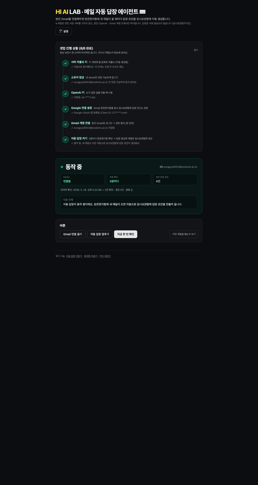
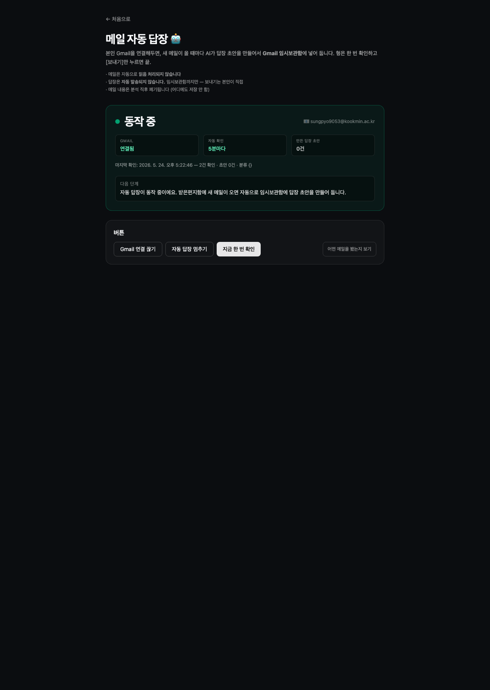
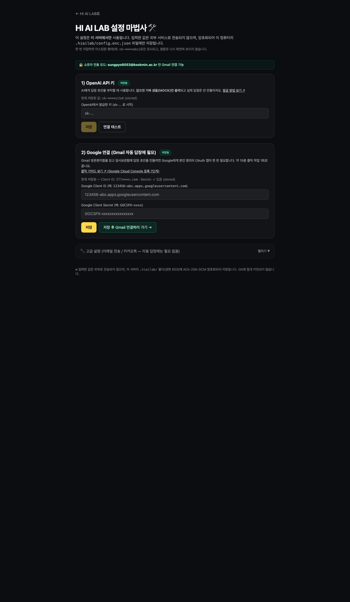

# ✉️ HI AI LAB

> **받은 메일을 정중한 답장으로 바꿔주는 셀프호스팅 AI 에이전트.**
> GitHub에서 코드 받아 본인 컴퓨터/서버에 올리고, 본인 OpenAI · Gmail 키만 넣으면 그 자리에서 동작합니다.
> 입력한 메일은 **만든 사람의 서버를 거치지 않습니다.** 본인 계정 안에서만 처리됩니다.

> 🎬 **유튜브 가이드 영상**: _(영상 업로드 후 링크 교체)_

## 🟢 운영 인스턴스 상태 (LIVE)

| | |
| --- | --- |
| **공개 URL** | <https://43.203.127.212.nip.io> (HTTPS, Caddy 자동 인증서) |
| **호스트** | AWS Lightsail Ubuntu 24.04 (Seoul, `ap-northeast-2a`) · `43.203.127.212` |
| **셋업 진행** | ✅ 6/6 단계 모두 완료 |
| **AI 모드** | OpenAI 키 연결됨 (`sk-****zJoA`) |
| **Gmail** | `sungpyo9053@kookmin.ac.kr` 연결됨 |
| **소유자 잠금** | 위 Gmail 외 OAuth 거부 (`OWNER_EMAIL` 보호) |
| **자동 폴링** | 5분마다 받은편지함 확인 (동작 중) |
| **운영 방식** | Node.js + systemd (`hiailab.service`) + Caddy reverse proxy + Let's Encrypt HTTPS |
| **버전** | v0.3 — 6단계 셋업 파이프라인 UI 포함 |

> 이 인스턴스는 **단일 소유자만** 사용 가능합니다. 다른 사람이 OAuth 시도하면 `not_owner` 에러와 함께 즉시 연결 해제됩니다.

### 📸 동작 화면

**메인 페이지** — 6단계 셋업 진행 파이프라인이 한눈에. 동작 중/꺼져 있어요 큰 배지로 상태 표시.



**`/agent` — 자동 답장 상태 / 조작**



**`/setup` — 단순화된 설정 마법사 (외계어 다 한국어로)**



> ⚠️ **현재 버전은 "붙여넣기 기반 AI 자판기"입니다.** Gmail 받은편지함을 자동으로 읽고 임시보관함에 답장 초안을 만드는 기능은 다음 단계에서 추가됩니다. 자세한 범위는 아래 "[지금 되는 것 / 아직 안 되는 것](#-지금-되는-것--아직-안-되는-것)" 표를 보세요.

---

## 🤖 어떻게 동작하나요?

```
[받은편지함]                    [HI AI LAB 에이전트]              [임시보관함(Drafts)]
     │                                  │                                │
     │  ① 5분마다 새 메일 확인           │                                │
     ├─────────────────────────────────▶│                                │
     │  (읽음 처리 X)                    │                                │
     │                                  │ ② AI 분류                       │
     │                                  │   · 답장 필요? ✅                │
     │                                  │   · 뉴스레터/광고/알림 → 스킵    │
     │                                  │                                │
     │                                  │ ③ "답장 필요"만 AI가 답장 작성  │
     │                                  ├──────────────────────────────▶ │
     │                                  │                                │ ④ 임시보관함에 초안 저장
     │                                  │                                │   (자동 발송 절대 X)
     │                                  │                                │
     │                                  │                                ▼
     │                                                          [본인이 Gmail에서 검토 후 발송]
```

### 이렇게 보입니다
- 아침에 Gmail 열면 임시보관함에 답장 초안 N건이 미리 만들어져 있음
- 광고/뉴스레터는 그대로 받은편지함에 (안 건드림)
- 본인이 검토만 하고 보내기 누르면 끝 → 답장 시간이 크게 줄어듦
- AI가 잘못 만든 초안은 그냥 삭제 (자동 발송 안 함)

### 보장하는 것
- ✅ 받은편지함을 **읽음 처리하지 않음**
- ✅ 답장을 **자동 발송하지 않음** (임시보관함까지만)
- ✅ 메일 본문은 분석 직후 **즉시 폐기** (DB에 저장 안 함)
- ✅ 입력한 모든 글은 **본인 OpenAI/Gmail 계정 안에서만** 처리, 만든 사람 서버 안 거침

### 자동화 사용 가이드 → [docs/SETUP_GMAIL_AUTOMATION.md](./docs/SETUP_GMAIL_AUTOMATION.md)

> 자동화 없이 **수동으로 메일 한 통씩 붙여넣어 답장 만들기**도 됩니다 (메인 페이지의 답장 자판기).

---

## 👋 먼저 고르세요

| 나는 이런 사용자입니다 | 어디로 가세요 |
| --- | --- |
| 🤖 **Gmail 자동 답장 에이전트 켜고 싶어요** | [docs/SETUP_GMAIL_AUTOMATION.md](./docs/SETUP_GMAIL_AUTOMATION.md) |
| 🆕 개발자가 아니고, 일단 내 컴퓨터에서 실행해보고 싶어요 | [QUICKSTART.md](./QUICKSTART.md) (10~20분 가이드) |
| 💻 개발자이고 바로 실행하고 싶어요 | 아래 "[🚀 따라서 세팅해보기 5단계](#-따라서-세팅해보기-진짜-핵심-5단계)" |
| 🖥️ 개인 서버에 올려서 쓰고 싶어요 | [docs/DEPLOY_SERVER.md](./docs/DEPLOY_SERVER.md) |
| 🔑 키가 뭐고 왜 필요한지 모르겠어요 | [docs/KEYS.md](./docs/KEYS.md) (한 페이지 정리) |
| 🤖 OpenAI 키 설정 / ChatGPT Plus와 차이 | [docs/SETUP_OPENAI.md](./docs/SETUP_OPENAI.md) |
| 📧 Gmail / 이메일 설정 | [docs/SETUP_GMAIL.md](./docs/SETUP_GMAIL.md) |
| 💬 카카오톡 설정 (선택) | [docs/SETUP_KAKAO.md](./docs/SETUP_KAKAO.md) |
| 🤔 뭔가 안 돼요 | [docs/FAQ.md](./docs/FAQ.md) |

---

## ✅ 지금 되는 것 / ❌ 아직 안 되는 것

| | 지금 됩니다 (이번 버전) | 아직 안 됩니다 (다음 단계) |
| --- | --- | --- |
| **Gmail 자동 답장 에이전트** | ✅ Gmail OAuth 연결 → 받은편지함 5분마다 확인 → 답장 필요한 메일만 분류 → **Gmail 임시보관함에 답장 초안 자동 생성** | ❌ 자동 발송(보장 안 함 · 정책상 금지) |
| 수동 메일 답장 | ✅ 받은 메일을 **붙여넣으면** AI가 답장 5종 생성 | — |
| 답장 결과 보내기 (수동) | ✅ 본인 이메일(SMTP) · 본인 카톡 '나와의 채팅' | — |
| AI | ✅ OpenAI API 연동 (실제 답장은 키가 있어야 나옴 · 키 없으면 가짜 샘플) | — |
| 회의록 / 카피 | ✅ 보너스 자판기 2종 | — |
| 카카오 | ✅ **본인** 나와의 채팅 | ❌ 카카오 채널 고객 발송 · 알림톡/친구톡 |
| 결제 | — | ❌ 실제 결제 없음 |
| 다른 메일 서비스 | ✅ SMTP라면 네이버/Daum도 가능 (수동 설정) | ❌ 네이버 메일 자동 연동 (OAuth는 Gmail만 지원) |

---

## ✅ 필요 준비물 (시작 전 체크)

| | 항목 | 어디서 | 없으면 어떻게 되나? |
| --- | --- | --- | --- |
| 1 | **컴퓨터** (macOS / Windows / Linux) | — | 필수 — 없으면 못 씀 |
| 2 | **Node.js 20 이상** | <https://nodejs.org/> → LTS | 필수 — 없으면 못 씀 |
| 3 | **터미널** (macOS 터미널 / Windows PowerShell) | OS 기본 제공 | 필수 — 없으면 못 씀 |
| 4 | **OpenAI API 키** | <https://platform.openai.com/api-keys> | **진짜 AI 답장 받으려면 필수.** 없으면 가짜 샘플(MOCK)만 출력됨 |
| 5 | **Gmail 앱 비밀번호** | <https://myaccount.google.com/apppasswords> | **실제로 메일 받으려면 필수.** 없으면 "보낸 척"만 하고 메일은 안 옴 |
| 6 | **카카오 access token** (선택) | 카카오 개발자 콘솔 | 본인 카톡으로 받기 원할 때만. 없으면 카톡 전송 안 됨 |

> **1~3번은 시작 전에 반드시 준비.**
> **4·5번은 일단 비워두고 띄워서 화면만 둘러볼 수는 있지만, 실제로 쓰려면 둘 다 채워야 합니다.**
> 6번은 처음엔 건너뛰셔도 됩니다.
>
> 키 받는 법 → [docs/KEYS.md](./docs/KEYS.md) 한 페이지에 정리되어 있습니다.

---

## 🚀 따라서 세팅해보기 (진짜 핵심 5단계)

영상에서 보면서 그대로 복사해 붙여넣기만 하면 됩니다.

### 1️⃣ 코드 받기
```bash
git clone https://github.com/sungpyo9053/hiailab.git
cd hiailab
```

### 2️⃣ 환경변수 파일 만들기 + 자물쇠 키 1줄 채우기
```bash
cp .env.local.example .env.local
```
그 다음 터미널에서:
```bash
openssl rand -base64 32
```
→ 나오는 글자(예: `Kj9HsLp.....=`)를 복사해서, 텍스트 에디터로 `.env.local`을 열고:
```env
APP_ENCRYPTION_KEY=Kj9HsLp.....=
```
> Windows는 PowerShell에서 `[Convert]::ToBase64String((1..32 | %{[byte](Get-Random -Max 256)}))`

### 3️⃣ 설치 + 실행
```bash
npm install
npm run dev
```
→ `Ready in ...` 메시지가 보이면 성공.

### 4️⃣ 브라우저에서 키 연결
<http://localhost:3000/setup> 접속 → OpenAI 키 / Gmail SMTP / (선택) 카카오 토큰 입력 → **저장** + **연결 테스트** 클릭

### 5️⃣ 받은 메일에 답장 만들기
<http://localhost:3000> 으로 가서 → 받은 메일 본문 붙여넣기 → **`✉️ AI에게 부탁하기`** → 결과 확인 → **`✉️ 내 이메일로 보내기`** 로 본인 메일함에 전송

끝 🎉

---

## 📖 더 자세히

| 막히는 부분 | 가이드 |
| --- | --- |
| 키가 뭐고 왜 필요한가요? | [docs/KEYS.md](./docs/KEYS.md) |
| OpenAI 키 발급 | [docs/SETUP_OPENAI.md](./docs/SETUP_OPENAI.md) |
| Gmail 앱 비밀번호 발급 | [docs/SETUP_GMAIL.md](./docs/SETUP_GMAIL.md) |
| 카카오 토큰 발급 | [docs/SETUP_KAKAO.md](./docs/SETUP_KAKAO.md) |
| 내 컴퓨터에서 실행 (npm/Docker) | [docs/DEPLOY_LOCAL.md](./docs/DEPLOY_LOCAL.md) |
| 개인 서버(VPS)에 올리기 | [docs/DEPLOY_SERVER.md](./docs/DEPLOY_SERVER.md) |
| 자주 묻는 질문 | [docs/FAQ.md](./docs/FAQ.md) |
| 10분 셋업 풀버전 | [QUICKSTART.md](./QUICKSTART.md) |

---

## 🤖 어떤 서비스인가요?

HI AI LAB의 메인 기능은 **메일 답장 에이전트**입니다.

1. 받은 메일을 textarea에 붙여넣고
2. **`AI에게 부탁하기`** 한 번 누르면
3. AI가 다음 5종 답장을 한 번에 만들어줍니다:
   - 상황 요약
   - 답장 초안
   - 더 정중한 버전
   - 짧은 버전
   - 피해야 할 표현
4. 결과를 그대로 **본인 이메일** 또는 **본인 카카오톡 '나와의 채팅'** 으로 받을 수 있습니다.

### 그외 보너스 기능
- 📝 **회의록 정리** — 회의 메모 붙여넣으면 요약·결정사항·담당자별 할 일로 분해
- 🛍️ **상품 카피** — 상품 정보로 광고/상세페이지/긴 설득 카피 3종

메인은 답장이고, 위 둘은 같은 엔진을 다르게 쓴 보너스입니다.

---

## 🔐 보안 / 개인정보

이 서비스는 **셀프호스팅** 입니다. 즉:

- 입력한 모든 글은 **본인 컴퓨터/서버 안에서만** 처리됩니다.
- 만든 사람(저)의 서버를 거치지 않습니다. 만든 사람은 본인이 무엇을 입력했는지 볼 수 없습니다.
- AI 호출은 본인의 OpenAI 계정으로 직접 가고, 메일 발송은 본인의 Gmail 계정으로 직접 갑니다.
- `/setup`에서 저장한 키는 **이 컴퓨터의 `.hiailab/config.enc.json`** 에 AES-256-GCM으로 암호화 저장됩니다.

### ⚠️ 절대 하지 말 것
- 실제 API 키를 **GitHub에 push** 하지 마세요. (`.env.local`이 실수로 함께 커밋되지 않게 — 이미 `.gitignore`로 막혀 있긴 합니다)
- 키를 카톡/슬랙/이메일로 공유하지 마세요.
- 스크린샷에 키가 보이게 캡처하지 마세요.

유출되면 즉시 OpenAI/Gmail/카카오에서 해당 키를 **폐기 후 재발급**하세요.

---

---

## 🚀 운영 서버에 배포하기 (AWS Lightsail / 본인 도커 서버)

> 이미 다른 서비스가 도는 서버에 **별도 서브도메인으로** 올린다고 가정한 가이드입니다.

### 0. 사전 준비
- 서버에 SSH 접속 가능
- Docker + docker compose 설치돼 있음 (`docker --version`, `docker compose version` 확인)
- 본인 도메인에 서브도메인 A 레코드 추가 (예: `hi.example.com → 3.34.133.24`)
- AWS Lightsail 방화벽에 HTTP(80) / HTTPS(443) 포트 인바운드 허용

### 1. SSH 접속 후 코드 받기

```bash
cd ~ && git clone https://github.com/sungpyo9053/hiailab.git
cd hiailab
```

### 2. `.env.local` 만들기

```bash
cp .env.local.example .env.local
nano .env.local        # 또는 vim
```

최소 다음 7줄을 채웁니다.

```env
# 다른 서비스가 3000을 쓰고 있으면 3100/3200 등으로
HOST_PORT=3100

# AES-256-GCM 자물쇠 키. openssl rand -base64 32 로 생성한 값
APP_ENCRYPTION_KEY=...

# 본인 OpenAI API Key
OPENAI_API_KEY=sk-...

# 본인 Gmail 이메일 — 이 외 다른 Gmail은 OAuth 차단
OWNER_EMAIL=mygmail@gmail.com

# 공개 URL (Google OAuth redirect 계산 기준)
NEXT_PUBLIC_APP_URL=https://hi.example.com

# Gmail OAuth 앱 (docs/SETUP_GMAIL_AUTOMATION.md 따라 발급)
GOOGLE_OAUTH_CLIENT_ID=...
GOOGLE_OAUTH_CLIENT_SECRET=...
```

저장: nano → `Ctrl+O` Enter → `Ctrl+X`

### 3. Docker 빌드 + 실행

```bash
docker compose up -d --build
docker compose logs -f --tail=50    # Ready in ... 보이면 OK, Ctrl+C로 빠져나감
```

### 4. 기존 nginx 에 서브도메인 추가 (또는 Caddy)

**nginx 사용 시** — `/etc/nginx/sites-available/hi.conf`:

```nginx
server {
    listen 80;
    server_name hi.example.com;

    location / {
        proxy_pass http://127.0.0.1:3100;
        proxy_set_header Host $host;
        proxy_set_header X-Real-IP $remote_addr;
        proxy_set_header X-Forwarded-For $proxy_add_x_forwarded_for;
        proxy_set_header X-Forwarded-Proto $scheme;
    }
}
```

활성화 + HTTPS (Let's Encrypt 무료 인증서):

```bash
sudo ln -sf /etc/nginx/sites-available/hi.conf /etc/nginx/sites-enabled/
sudo nginx -t && sudo systemctl reload nginx
sudo certbot --nginx -d hi.example.com    # 처음이면 sudo apt install certbot python3-certbot-nginx
```

**Caddy 쓰면 더 간단** — `/etc/caddy/Caddyfile` 에 한 블록 추가:

```
hi.example.com {
    reverse_proxy localhost:3100
}
```
→ `sudo systemctl reload caddy`. HTTPS 자동.

### 5. Google OAuth redirect URI 추가

Google Cloud Console → **API 및 서비스 → 사용자 인증 정보 → OAuth 클라이언트 ID** 클릭 →
**승인된 리디렉션 URI**에 다음 추가:

```
https://hi.example.com/api/gmail/callback
```

저장.

### 6. 운영 확인

브라우저에서:
- `https://hi.example.com` → 메인 페이지 표시
- `https://hi.example.com/agent` → 큰 상태 카드에 **STOPPED** (Gmail 미연결)
- **"📨 Gmail 연결하기"** → 본인 Gmail로 로그인 → 동의 → `RUNNING` 으로 바뀌면 성공

소유자가 아닌 다른 Gmail로 로그인하면:
> ⚠ 이 인스턴스는 소유자(OWNER_EMAIL) 이메일로만 연결할 수 있습니다.

라는 메시지와 함께 즉시 연결 해제.

### 7. 운영 점검 명령어

```bash
docker compose ps                          # 컨테이너 떠 있는지
docker compose logs -f --tail=100           # 실시간 로그
docker compose restart                      # 환경변수 바꾼 뒤
docker compose down                         # 중지
docker compose up -d --build                # 코드 업데이트 후 재배포
git pull && docker compose up -d --build    # 위 두 줄 합본
```

---

현재 한계와 자주 묻는 질문은 → [docs/FAQ.md](./docs/FAQ.md)
